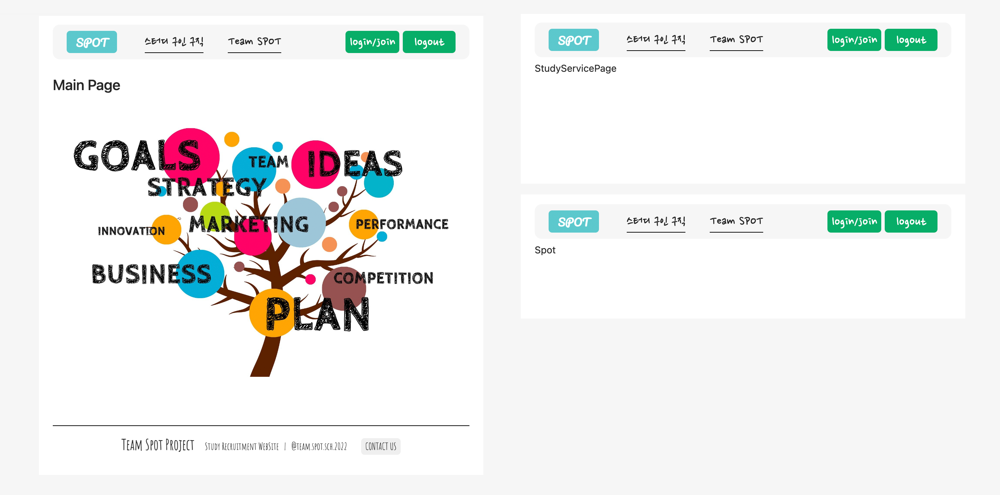
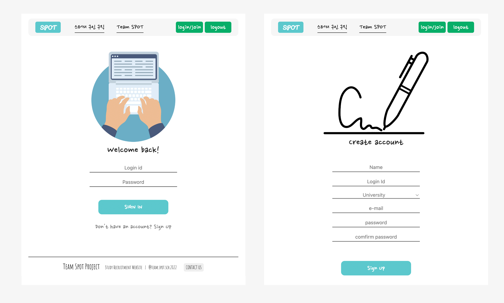

# Team SPOT Project :: 스터디 구인&구직 웹앱

---

## 프로젝트 소개

---

아산 천안내 대학생들이 스터디를 구인 및 구직 하기 위한 웹애플리케이션

## 기술 스택

---

<h1>📚 STACKS</h1>

  
  
  
  

   
  
  
  
   

## 프로젝트 실행

### spot_project

### `npm run dev` :: 서버및 클라이언트 동시 실행

### `npm run backend` :: 서버 실행

 

### spot_project/client

### `npm run start` :: 클라이언트 실행

 

## 프로젝트 디렉토리 구성 및 파일정보

---

### server

 서버 관리 ... 

### client

#### \_action, \_reducer

 Redux를 위한 폴더들 

#### components/views

 Page 관리 폴더 

 해당 페이지에 관련되 추가 Component는 Sections 폴더를 생성하여 관리 

#### App.js

 Routing 관리 

#### Config.js

 환경 변수 관리 

#### hoc

 Higher Order Component 관리 

#### utils

 여러 곳에서 쓰이는 추가 파일등을 관리 

 

## 구현기능 history

---

### 2022.07.06

 

 

 
1. 서버 구축 및 로그인, 회원가입 기능 구현
2. 회면 구성 기본 프레임 작성및 라우팅
3. 로그인 구현
4. 회원가입 구현

---

 

## 추가 필요 개선 사항

---

### 2022.07.06

1. 페이지 최적화 필요
2. 로그인 로그아웃 버튼 하나의 버튼으로 통일 하여 관리 필요
   비로그인 상태: login/join 버튼 || 로그인 상태: logout 버튼

---
